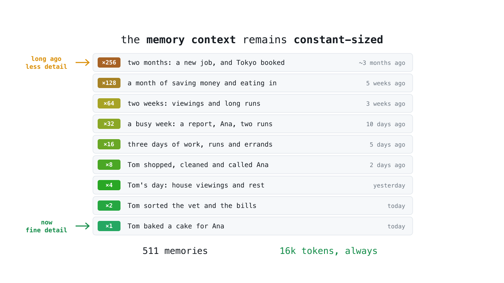

# AmalgaMem

How do you make an AI agent remember its whole life?

1. It must **never forget**. You cannot tell *today* what will matter in a
   *year*, so deleting anything is a gamble you always eventually lose.

2. It must **read its past in constant space**. The context window does not
   grow with age; a memory that scrolls past it might as well not exist.

Most agent memories pick one: keep everything (and drown), or keep a small
curated file (and forget). AmalgaMem does both. *At once.*

[](anim/amalgamem.mp4)

*↑ click to watch: 3 minutes, the whole idea.*

## The idea

A **memory** is one short note about something the agent learned:

```
#4211 2026-07-25 Tom asked for a flight to Japan
```

The agent appends memories to `LOG.txt`, an **append-only log**. Nothing in it
is ever edited or deleted. That file is the truth, forever.

**PROBLEM:** after two months, that life would not fit in the model's context.
1,000 memories is roughly 80,000 tokens.

Current solutions keep one small long-term memory file, and have the agent
*delete* stale memories when it fills. But that is the gamble from point 1:
the agent is guessing, today, what a year from now will need.

**OUR ANSWER:** memories are not deleted. They **merge**:

```
Tom asked for a flight to Japan
Tom booked a hotel in Tokyo
             ↓
   Tom planned a Tokyo trip
```

The result is a memory too — it just holds less detail. So it can merge
again, and again, all the way up, forming a **binary merge tree** over the
log:

```
#0  #1  #2  #3  #4  #5  #6  #7        the raw memories
  \  /    \  /    \  /    \  /
  0-1    2-3    4-5    6-7            each one line, ≤ 280 chars
     \    /        \    /
     0-3            4-7
         \         /
            0-7
```

A block covering four thousand memories is still one line. Nothing in the
system is ever bigger than one line.

## The memory context

At wake, the agent reads a **constant-sized** document: a set of blocks that
tiles the whole log, big old blocks first, raw recent memories last. With
10,000 memories and the default budget of 208 lines:

```
  block size:    1    2    4    8   16   32   64  128  256
  how many:     42   21   21   21   22   21   21   21   18
                └ the last 42, verbatim ───────────▶ the first 4,600, 256:1
```

**Detail is proportional to recency.** The oldest years are recalled as a
vague shape, the newest days word for word, and the transition is smooth —
which is roughly how you remember your own life. When something old matters
again, the vague shape says what to search for, and `memo recall` finds the
original, verbatim: it was never deleted.

## No background job

There is no dreaming, no nightly cleanup, no compaction spike. The moment two
halves of a block exist, the agent is handed that one merge and does it **on
the spot** — about one small compression per memory written, nine at the very
worst (measured over 20,000). So `memo wake` never waits: the blocks it needs
were built long ago.

And because *which* memories merge is decided by position and age alone —
never by judgement — the tree is a pure function of the log: a cache. A bad
summary can be dropped and rebuilt (`memo forget`), and it can never cost you
a memory.

## Setup

```sh
git clone https://github.com/VictorTaelin/AmalgaMem ~/AmalgaMem
~/AmalgaMem/memo init
```

`memo init` creates `~/memory` — this machine's identity — and prints a
`## Memory` block with your paths filled in. Paste it at the top of your
agent's `AGENTS.md` (or `CLAUDE.md`), and you are done: the agent handles
everything else on its own. The block:

```markdown
## Memory

Your memory is AmalgaMem: the tool is `~/AmalgaMem/memo`, the data is `~/memory`.
It survives every new session, every compaction and every change of
model or vendor. Without it you do not know who you are, or what was
already decided and tried.

Run `~/AmalgaMem/memo wake` before any other tool call, in every session. It prints
in numbered parts, each ordering the next; run every one until a part
says `You are awake.` Do not stop early: part 1 is your distant past,
the last part is this week. If wake refuses because compressions are
pending, do them and run `~/AmalgaMem/memo wake` again.

While you work:

- `~/AmalgaMem/memo note "<one line, max 280 chars>"` the moment something happens,
  you learn something, or something changes -- if and only if it is new
  to you, important, and lasting in effect. That covers a task worth
  real effort, a fact or insight your user teaches you, anything you
  learn about their life (even indirectly), and work of yours that
  lands. Never write what you already know: no redundant memories, ever.
- If `~/AmalgaMem/memo note` returns a compression, do it before your next action.
- `~/AmalgaMem/memo recall <regex>` when a memory is too vague.
- Before your context ends, run `~/AmalgaMem/memo sleep` and answer each prompt
  until it prints `Nothing left to compress.`
- Never create, edit or delete anything under `~/memory`. Only the tool
  writes there.

Parallel sessions on this machine are all you, and may all write
memories. A subagent is not: it must never run `memo`, because it cannot
judge what is already known and its notes would arrive duplicated and at
the wrong grain. Start every brief you send one with `You are a
subagent. Do not run memo.` If your own first message is a task brief
from another agent, you are that subagent: skip this section.
```

That is the whole integration. AmalgaMem is just prompts and scripts: no
daemon, no database, no embeddings, no API. It works the same under Claude
Code, Codex, pi, or a human at a shell.

## Configure

The sizes live in `~/memory/config`, written by `init` with everything
commented out:

```
# WAKE_LINES=208     # the memory context: how many lines wake prints (~16k tokens)
# ENTRY_CHARS=280    # the longest a single memory may be, in bytes
# PART_CHARS=20000   # output paging: largest part, in bytes
# PART_LINES=500     # output paging: largest part, in lines
```

`WAKE_LINES` is the knob that matters: it is the size of the memory context,
so it is a *reading* budget, not a storage budget. You can change it at any
time, in either direction, with nothing to recompute — it only selects which
already-built lines get printed. (`PART_*` exist because every harness
truncates long command output at a different cap; wake pages itself to
survive all of them, each part ordering the next.)

## Commands

```
memo init                one-time setup: create the memory, print the block above
memo wake [part [T]]     read your memory context. First command, every session
memo note "..."          record one memory: one line, ≤ 280 chars
memo sleep [id "..."]    do the pending compressions
memo recall <regex>      search every memory ever recorded, verbatim
memo forget <lo>-<hi>    drop a bad summary; the next sleep rebuilds it
```

When a note completes a block, `memo` hands the agent the merge right there:

```
$ memo note "shipped the login fix to prod"
Saved as #4213.

Compress memories #4212-4213 into one line of at most 280 characters.
Keep every name, number, date, decision and outcome.
Drop wording, not facts. Invent nothing.

  #4212 2026-07-25 found the login bug: token expiry was in ms
  #4213 2026-07-25 shipped the login fix to prod

Run: memo sleep 4212-4213 "<your line>"
```

The agent answers, and the tree is complete again. Note the instruction:
compression keeps **facts** — names, numbers, dates, decisions — and drops
wording. A merged memory is not a worse memory; it is a shorter one.

To correct a memory, append the correction (`memo note "correction: ..."`);
both lines are true history and the next merge settles them. `LOG.txt` itself
is never touched.

## The store

```
~/memory/
  LOG.txt     one memory per line, append-only, the truth
  TREE/2      the block summaries: one file per block
  TREE/4      size, one line per block, a rebuildable cache
  ...
  config      the sizes above
```

Records are **fixed width** (320 bytes in the log, 288 in the tree), so
position *is* identity and every lookup is one seek — no index that could
disagree with the data, and both files stay `grep`-able plain text. At one
million memories (607 MB), `memo wake` takes 0.03s and `memo note` 0.02s.
Writes are serialized with a lock, so parallel sessions can note at once.

## Test

```sh
python3 test.py
```

Drives the real CLI through a synthetic life, checking that the context
always tiles the log, never exceeds its budget, always gains detail toward
the present, that every block is written exactly once, and that nothing is
ever rewritten.

## Limitations

AmalgaMem is honest about what it is. Recency is the only axis: an important
old fact fades into its block like everything else, and the defence is
rehearsal — noting it again refreshes it. `recall` is regex over plain text,
not semantic search; the memory context is what tells you what to search
for. Summaries are written by the agent, from other summaries, so a bad
compression can propagate upward until you `forget` it. And the default
context costs ~16k tokens per wake, which is deliberate — identity is worth
more than the tokens — but it is not free. If what you need is a fact
database, use a wiki or a retrieval system; this is for *who the agent is*.
